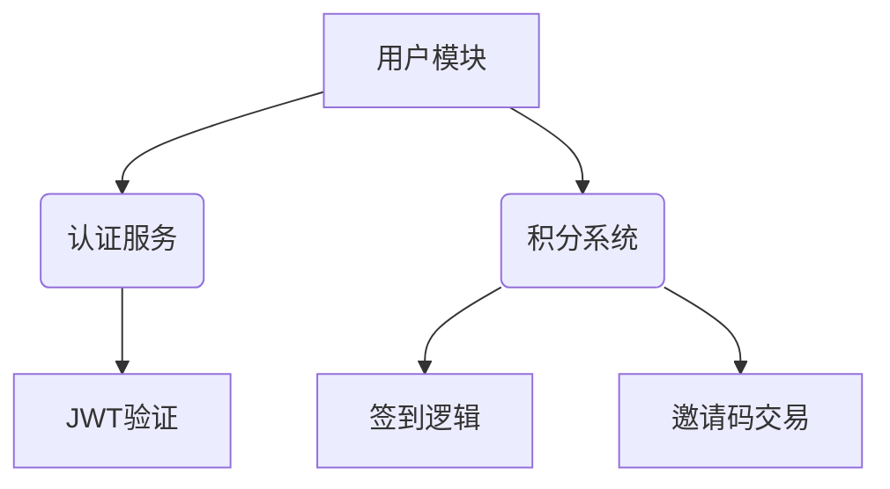
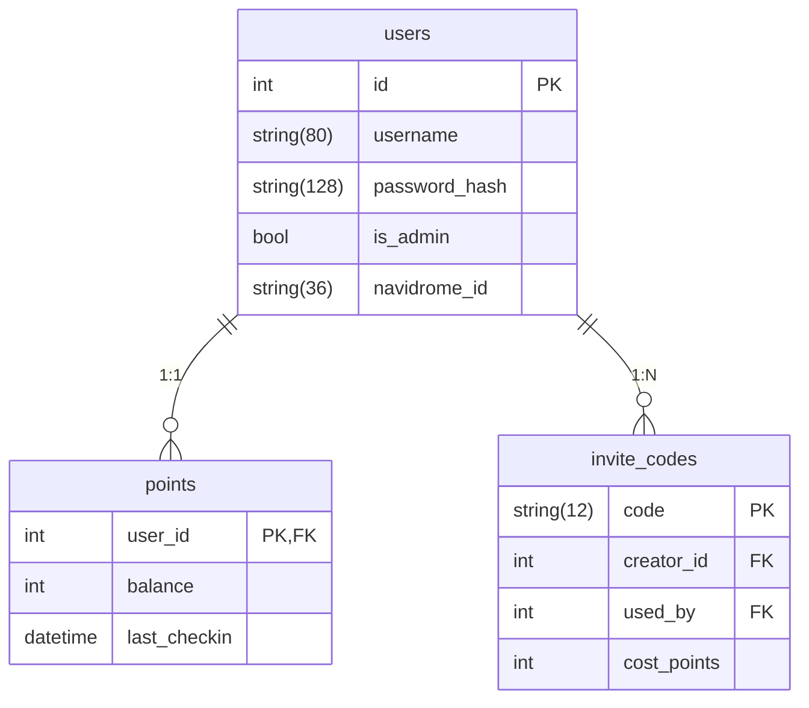

# CRABMUSIC
---

### **优化后的项目目录结构**
```bash
/mnt/dev/MUTE/
├── backend/                  # 后端服务
│   ├── src/
│   │   ├── core/            # 核心逻辑
│   │   │   ├── database.py  # 数据库连接
│   │   │   └── security.py  # 安全相关配置
│   │   ├── features/        # 功能模块
│   │   │   ├── auth/        # 认证模块
│   │   │   │   ├── router.py
│   │   │   │   └── service.py
│   │   │   ├── user/        # 用户模块
│   │   │   │   ├── model.py
│   │   │   │   └── router.py
│   │   │   └── points/      # 积分模块
│   │   │       ├── logic.py # 积分计算规则
│   │   │       └── router.py
│   │   ├── utils/
│   │   │   ├── validators/  # 数据校验器
│   │   │   └── middleware/  # 自定义中间件
│   │   └── main.py          # 应用入口
│   ├── migrations/          # 数据库迁移脚本
│   └── requirements.txt     # 按功能分组的依赖
│
├── frontend/                # 前端SPA
│   └── src/
│       ├── modules/         # 功能模块
│       │   ├── user/        # 用户模块
│       │   │   └── ProfilePage.vue
│       │   └── admin/       # 管理模块
│       │       └── UsersPanel.vue
│       └── services/        # API服务
│           └── apiClient.js # 统一请求封装
│
├── docs/                    # 文档中心
│   ├── API_EXAMPLES.md      # API调用示例
│   └── DB_SCHEMA.md         # 数据库设计文档
│
└── infrastructure/          # 基础设施
    ├── docker/
    │   ├── backend.Dockerfile
    │   └── frontend.Dockerfile
    └── scripts/
        └── init_db.py       # 数据库初始化脚本
```

---


# Navidrome用户管理系统

[]()
[]()

专为Navidrome设计的轻量级用户管理系统，支持积分体系和邀请码功能

## ✨ 核心功能
### 普通用户
- 📌 每日签到获取随机积分
- 🎟️ 用积分兑换邀请码
- 📊 实时积分余额查看
- 👤 个人信息管理

### 管理员
- 👥 用户CRUD操作
- 🎯 精确积分调整
- 🔑 邀请码生命周期管理
- 📈 用户行为日志审计

## 🛠️ 技术栈
| 层级       | 技术方案               |
|------------|-----------------------|
| **后端**   | Flask + SQLAlchemy    |
| **前端**   | Vue3 + Element Plus   |
| **数据库** | SQLite3               |
| **部署**   | Docker Compose        |

## 🚀 快速启动
### 基础环境
```bash
# 安装依赖
pip install -r backend/requirements.txt
npm install --prefix frontend

# 初始化数据库
python infrastructure/scripts/init_db.py
```

### 开发模式
```bash
# 启动后端
flask run --port=5000 --debug

# 启动前端
cd frontend && npm run dev
```

### 生产部署
```bash
docker-compose -f infrastructure/docker-compose.prod.yml up -d
```

## 📦 模块化设计


## 📄 数据库设计
### 核心表结构
| 表名          | 字段                     | 说明                         |
|---------------|-------------------------|-----------------------------|
| users         | id, username, is_admin  | 主用户表                    |
| points        | user_id, balance        | 积分数据（外键关联users.id） |
| invite_codes  | code, creator_id, cost  | 邀请码系统                  |

## 📌 开发路线
1. **第一阶段**：核心用户系统（已完成）
2. **第二阶段**：积分模块开发（进行中）
3. **第三阶段**：管理后台实现

## 🤝 贡献指南
欢迎通过Issue提交建议或PR贡献代码，请遵循：
1. 新功能开发需配套测试用例
2. 提交前执行代码格式化
3. 保持API向后兼容性

## 📜 许可证
[MIT License](LICENSE)
```

---

### **数据库设计文档补充**
```markdown
## 🔗 表关系示意图


---

### **优化亮点**
1. **模块化架构**：按功能拆分feature目录，避免代码臃肿
2. **渐进式开发**：通过开发路线图明确阶段目标
3. **文档友好**：集成mermaid图表直观展示系统关系
4. **安全增强**：独立security.py集中管理认证逻辑
5. **部署简化**：提供从开发到生产的全流程指南

需要继续完善具体模块时，可以告知需要优先开发的功能部分，我会提供针对性代码实现方案。
